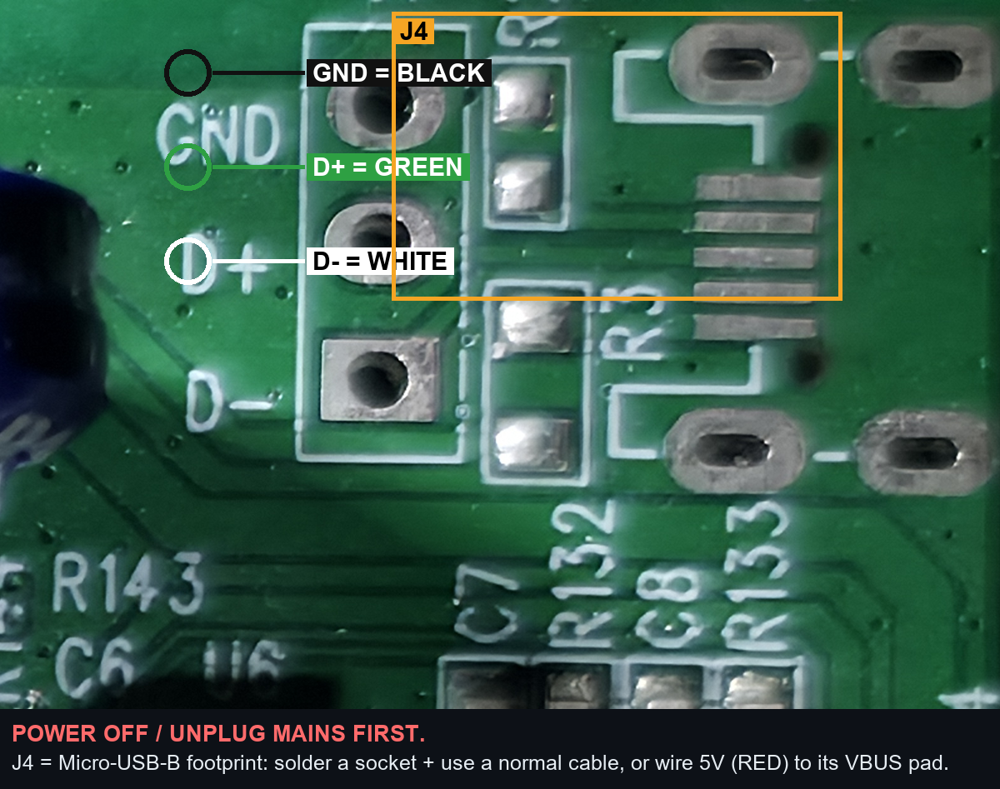

# Flashing guide — getting the firmware onto the iHub-Pro

The iHub-Pro has **no exposed USB port**, so the very first flash needs a small
one-time hardware step: solder a USB connection to the board. **After that you never
have to open the case again — all further updates are done over-the-air (OTA) from the
web UI.**

---

## ⚠️ Read this first — safety

> **DANGER — mains voltage.** The iHub-Pro switches 230 V AC. Parts of the board
> (the BL0940 energy-meter section) sit at **mains potential**.
>
> - **Unplug the device from the wall and wait a minute before opening it.**
> - **Never** connect USB while the device is plugged into mains — you can destroy your
>   PC and injure yourself.
> - Only do this if you are comfortable with electronics and soldering. **You do this at
>   your own risk** (see the project [LICENSE](../LICENSE), no warranty).

---

## What you need

- A soldering iron + a steady hand.
- **Either** a **Micro-USB-B socket** (the easy, recommended way) **or** a spare
  **USB cable** you can cut and strip.
- A normal USB cable to your PC.
- [PlatformIO](https://platformio.org/) installed (it brings `esptool`), or `esptool`
  on its own (`pip install esptool`).
- A modern PC. The ESP32-S3 has **native USB** (USB-Serial-JTAG) — **no driver needed**;
  it just shows up as a COM port / `/dev/ttyACM*`.

---

## Step 1 — Open the case & find the USB pads

Unplug from mains, open the enclosure, and find the USB area on the main board (top-right
corner, next to the ESP32-S3 module). There are two solder options right next to each
other:

- **`J4`** — an unpopulated **Micro-USB-B footprint** (carries 5 V / D− / D+ / GND).
- **`J1`** — a 3-pad test header silk-screened **`GND` / `D+` / `D−`** (data + ground).



---

## Step 2 — Make the USB connection

### Option A (recommended): solder a Micro-USB-B socket into `J4`
Solder a Micro-USB-B jack onto the `J4` footprint, close the case enough to reach it, and
just plug in a **normal Micro-USB cable**. The socket carries 5 V, D−, D+ and GND in the
correct order — nothing to get wrong.

### Option B: solder a USB cable directly
Cut a USB cable, strip the four wires, and solder them as follows:

| USB wire (typical colour) | Pad on the board |
|---|---|
| **Black** — GND | `J1` → **GND** |
| **Green** — D+ | `J1` → **D+** |
| **White** — D− | `J1` → **D−** |
| **Red** — 5 V (VBUS) | `J4` → **VBUS / 5 V** pad |

> Colours follow the USB standard but cheap cables sometimes differ — if unsure, check
> the wires with a multimeter (5 V/GND from a USB port) before soldering. Keep the 5 V and
> GND from crossing.

---

## Step 3 — Connect to the PC

Plug the USB cable into your PC. A new COM port / serial device should appear within a few
seconds (no driver needed).

- **Windows:** Device Manager → *Ports (COM & LPT)* → note the `COMx` number.
- **Linux/macOS:** `/dev/ttyACM0` (or similar).

> **If nothing shows up or flashing fails:** put the chip into ROM download mode — hold
> **GPIO0 / BOOT to GND** while plugging in USB, then release. (Most boards flash fine
> without this via USB-Serial-JTAG.)

---

## Step 4 — Back up the original Mars Hydro firmware (strongly recommended)

So you can always return to stock, dump the full 8 MB flash **before** flashing:

```bash
esptool --chip esp32s3 -p COMx read_flash 0 0x800000 ihub_original_8MB.bin
```

The file must be exactly **8,388,608 bytes**. Keep a copy somewhere safe (not only on the
PC you flash from). If the USB link is flaky and the read aborts, read it in 1 MB chunks
with retries and concatenate.

---

## Step 5 — Flash the open firmware

With [PlatformIO](https://platformio.org/) from the repo root:

```bash
pio run -e ihub -t upload --upload-port COMx
```

(or just `pio run -e ihub -t upload` and let it auto-detect the port).

That's it. The device reboots into the open firmware.

---

## Step 6 — First boot

The device has no Wi-Fi yet, so it opens a setup hotspot **`iHub-Pro-Setup`**. Connect to
it, follow the captive portal to enter your Wi-Fi, then open `http://ihub.local/` and set
a login password. Full walkthrough: **[README → First boot](../README.md#-first-boot)**
and the **[Handbook](HANDBOOK.md)**.

---

## Step 7 — Future updates = no soldering

From now on, update straight from the browser:

**Settings → Firmware update → pick `firmware.bin` → Upload & flash.**

A bad image is rolled back automatically by the boot-validator, so OTA is safe. You only
ever need the USB connection again if you brick the bootloader itself.

---

## Restoring the stock firmware

```bash
esptool --chip esp32s3 -p COMx write_flash 0 ihub_original_8MB.bin
```
